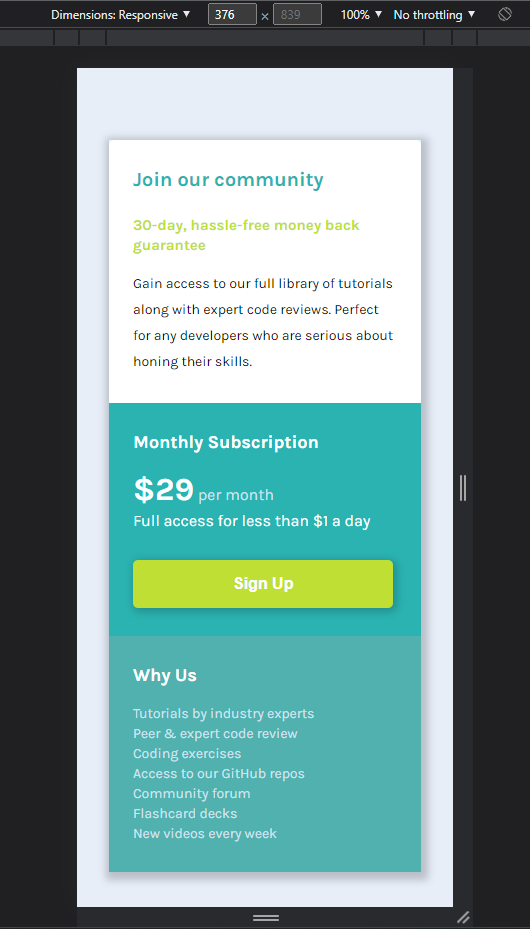
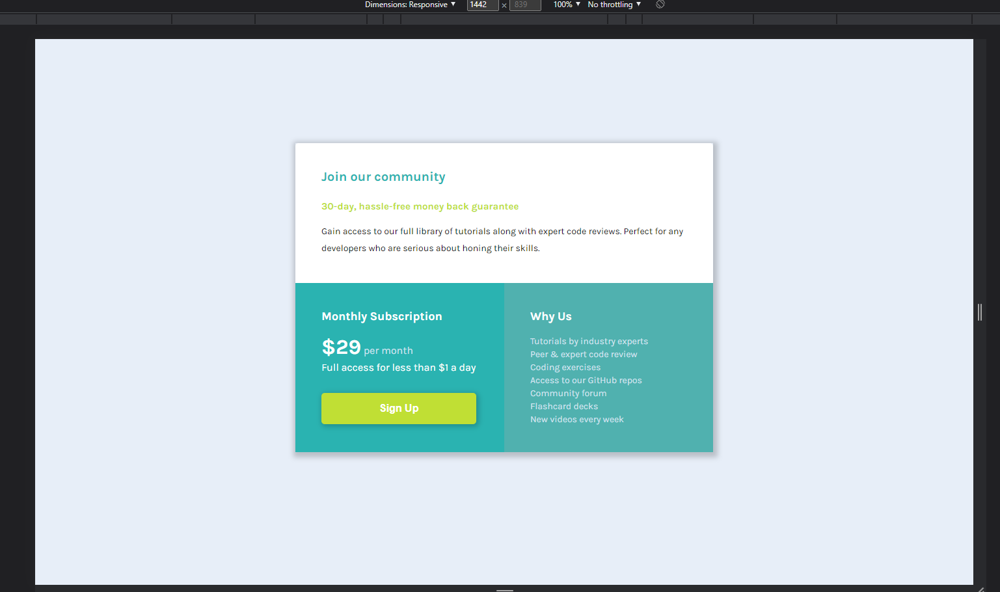

# Frontend Mentor - Single price component solution

## This is a solution to the challenge of Frontend Mentor ✌🏽

### Table of contents
=====================
<!--ts-->
#### Overview
  * [The Challenge](#TheChallenge)
  * [Screenshots](#Screenshots)

#### My Process
  * [Build with](#BuildWith)
  * [What I Learned](#WhatILearned)

#### Author
<!-- te -->

## Overview
=============
### The Challenge
==================

Users should be able to:

  * View the optimal layout for the component depending on their device's screen size

  * See a hover state on desktop for the Sign Up call-to-action

### Screenshots
=================
* Mobile

* Desktop

## My process
==============
### Built with

  * Semantic HTML5 markup

  * CSS custom properties

  * Flexbox

  * Mobile-first workflow

  ## Author

  * Website - Maurício Augusto
  * Frontend Mentor - @mrc-augusto